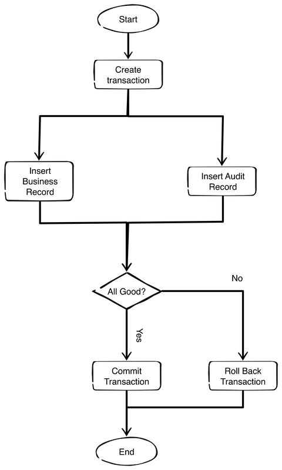

# Mistral

An enhanced version of the [Chinook sample database](https://github.com/lerocha/chinook-database) for use with SQLite, MySQL and PostgreSQL.

The objective is to present at least three implementations for each DBMS:

- The typical or idea database implementation for use with an object oriented language such as C# or JAVA etc.
- A typical legacy database that must be supported by a new application build using OOP technology
- An implementation that can be used to exercise all the data type offered by the particular DBMS.

In the traditions of Microsoft's demo database naming convention, We offer a European version to stand with Northwind and Chinook - Mistral, named after the French wind of the same name.

## The Business Domain

The Mistral data model represents a digital media store, similar to that of the Chinook data model, but extended to include auditing views etc. The model includes tables for artists, albums, media tracks, invoices and customers.

## Database Design

This section gives an overview of the preferred modern database design. One of the primary design objectives was to make it easy to map to the typical object models offered by languages such as C# or Java for example.

#### System Tables

All modern databases can benefit from having a couple of standard tables, to address common issues. And as these tables have no impact on the business design of a database, it is recommended to consider adding them to any legacy base you wish to work with, if possible.

##### Version Table

The version table servers two purposes:

- It allows one to check what the current version of the database is and thus one can ensure that the application that wish to use the database are in fact compatible with that particular version.
- It provides a history of the upgrades to the database over time.

The version table should include at least the following columns:

| Field      | Description                                                           |
| ---------- | --------------------------------------------------------------------- |
| id         | A unique id that identifies the record in the table                   |
| major      | The major version number                                              |
| minor      | The minor version number                                              |
| build      | The build version number                                              |
| started_at | The date and time the installation script began                       |
| ended_at   | The date and time the installation script completed                   |
| status     | Indicates the outcome of executing the upgrade or installation script |
| comments   | Any comments relating to the execution of the script                  |

##### Setup Table

This table is optional, but acts as a very useful centralised configuration repository for applications that use the database. Such a table should include the following fields:

| Field     | Description                                         |
| --------- | --------------------------------------------------- |
| id        | A unique id that identifies the record in the table |
| key       | The name of the key                                 |
| value     | The value of the key                                |
| data_type | The data type of the key value                      |

The table might also be extended with the following fields, which could be used to support a GUI interface for updating them:

| Field | Description                                                 |
| ----- | ----------------------------------------------------------- |
| min   | The minimum value of the entry                              |
| max   | The maximum value of the entry                              |
| range | A comma separated list of possible values for the key entry |

##### Log Table

This table is optional, but acts as a very useful centralised configuration repository for applications that use the database. Such a table should include the following fields:

| Field      | Description                                               |
| ---------- | --------------------------------------------------------- |
| id         | A unique id that identifies the record in the table       |
| entry_type | The time of entry: Debug, Info, Error, Warning or Fatal   |
| logged_at  | The date and time the entry was made                      |
| message    | The message                                               |
| stack      | The stack trace if any                                    |
| extra      | any additional information about the message being logged |

The table might also be extended with the following additional fields:

| Field       | Description                                                |
| ----------- | ---------------------------------------------------------- |
| logger_name | The logger name                                            |
| file_name   | The source code file name                                  |
| line_no     | The number of the line within the file logging the message |
| method_name | The name of the method logging the message                 |
| arguments   | The arguments passed to the method logging the message     |

And yet other possibilities might include user_name, device, location and so on.

##### Activity Log

This table is also optional, but might be worth including in your database as a simple means of tracking and accessing significant in respect of the database or it's applications, such as the creating of a new user account, a customer account and so on. Such a table should include the following fields:

| Field     | Description                                         |
| --------- | --------------------------------------------------- |
| id        | A unique id that identifies the record in the table |
| logged_at | The date and time the entry was made                |
| message   | The activity being logged                           |

#### Common Fields

All business entities in the database model should have the following fields to aid the development of OOP based applications and also to hand situations where records may be updated from multiple sources.

| Field      | Description                                                                                                                 |
| ---------- | --------------------------------------------------------------------------------------------------------------------------- |
| id         | A unique id that identifies the record in the table                                                                         |
| version    | The record version number, most often used to check if a record was changed since the user last loaded it from the database |
| created_at | The date and time the record was created                                                                                    |
| updated_at | The date and time the record was last updated                                                                               |

#### Auditing of Actions

If you have worked in IT for any period of time, no doubt you will have encountered situations where it is unclear if a record was updated or not and who actually performed the operation. The purpose of audition is to address this issue by tracking three types of change to individual records: INSERT, UPDATE and DELETE. The best approach from a performance point of view is to use an audit table per business table.

Theses tables should use a simple naming convention that meets the following requirements:

- Easy to understand and implement
- Groups the tables together while excluding them from the general list of business tables
- The name suggest the business table being audited

I usually name these tables as xxx_ and at a minimum include the following fields:

| Field          | Description                                                                  |
| -------------- | ---------------------------------------------------------------------------- |
| id             | A unique id that identifies the record in the table                          |
| changed_at     | The date and time the action was logged                                      |
| action         | The type of action being applied to the record: (I)nsert, (U)pdate, (D)elete |
| record_id      | The id of the record being audited                                           |
| record_version | The new version number of the record being audited                           |

In addition to these fields the table contains the fields from the associated business table that the developer wishes to audit.

The process of manipulating a business record involves creating a transaction, performing the action of the desired record, creating a corresponding audit record and then committing the transaction if all is OK, otherwise the transaction is rolled back.

## Design Documents

The individual implementations are discussed in these documents:

| File Name                          | Description                               |
| ---------------------------------- | ----------------------------------------- |
| [sqlite.md](doc/sqlite.md)         | The design implementation using SQLite    |
| [mysql.md](doc/mysql.md)           | The design implmentation using MySQL      |
| [postgresql.md](doc/postgresql.md) | The design implmentation using PostgreSQL |
