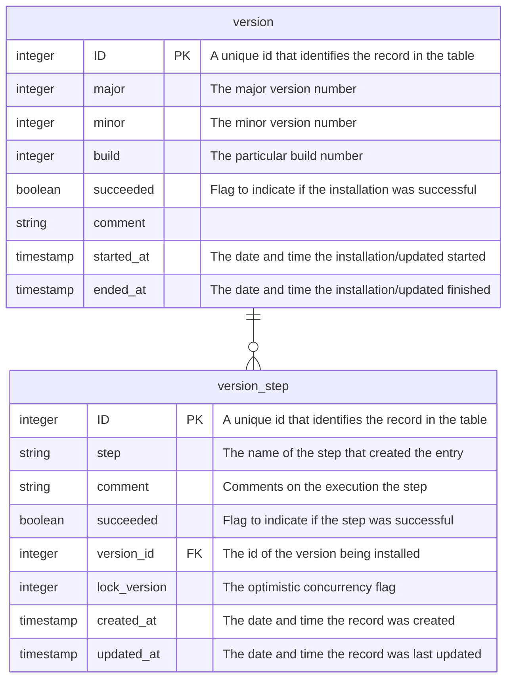
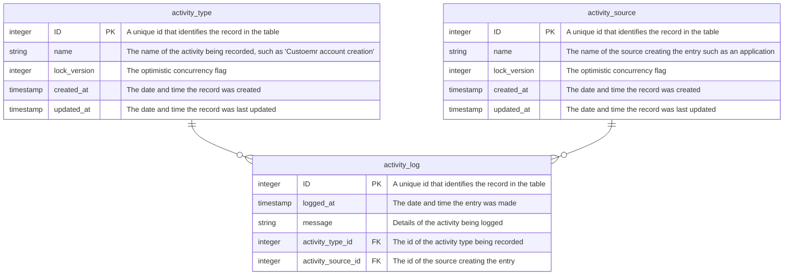
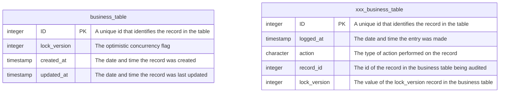
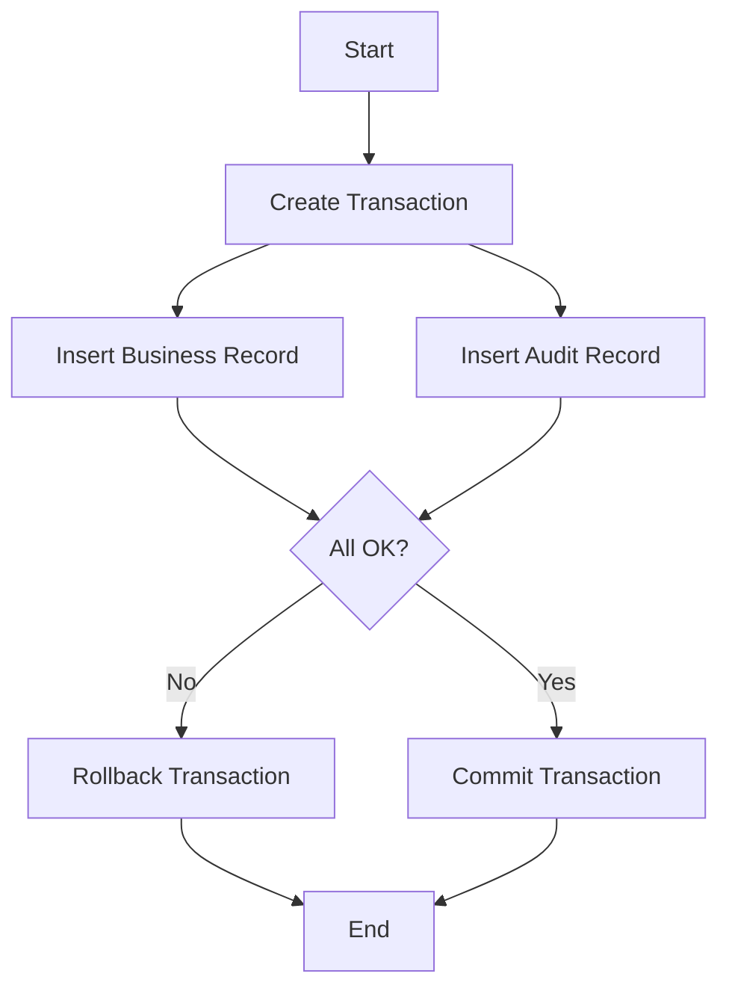

# Mistral

This sample database is broadly based on the [Chinook sample database](https://github.com/lerocha/chinook-database) The
main difference would be:

- The schema is more typical of a real production database, in that it includes views and store procedures
- It is scripted rather than being created by a ORM type tool
- It includes audit tables to track changes 
- It supports optimistic concurrency
- It takes advantage of DBMS specific features where they exist

In the traditions of Microsoft's demo database naming convention, We offer a European version to stand with Northwind 
and Chinook - Mistral, named after the French wind of the same name.

## The Business Domain

The Mistral data model represents a digital media store, similar to that of the Chinook data model, but extended to 
include auditing, views etc. The model includes tables for artists, albums, media tracks, invoices and customers.

## Database Design

This section gives an overview of the typical modern database design. One of the primary technical design objectives 
was to make it easy to map to the typical object models offered by languages such as C#, Java or Python for example.

Typically, the design ignores the natural primary key on tables and goes for an auto generated primary key as this 
makes it easier to load and map records to classes in the chosen programming language.

### System Tables

All modern databases can benefit from having a couple of standard tables, to address issues such as the database 
version number, if all updates have been applied to the database and so on. 

#### Version Table

The version table is optional, but can is definitely worth including in your design as it servers two purposes:

- It allows one to check what the current version of the database is and thus one can ensure that the application wishing to use the database is in fact compatible with that particular version.
- It provides a history of the upgrade scripts that have been applied to the database over time.

The version table should include at least the following columns:

##### Activity Log

This table is also optional, but might be worth including in your database as a simple means of tracking significant 
events in database, such as the creating of a new user account, a customer account and so on. Such tables should 
include the following fields:

### Common Fields

All business entities in the database model should have the following fields to aid the development of OOP based 
applications and also to hand situations where records may be updated from multiple sources.

If you have worked in IT for any period of time, no doubt you will have encountered situations where it is unclear if 
a record was updated or not and who actually performed the operation. The purpose of xxx_table is to address this issue 
by tracking three types of change to individual records: INSERT, UPDATE and DELETE. The best approach from a performance 
point of view is to use an audit table per business table.

The process of manipulating a business record involves creating a transaction, performing the action of the desired 
record, creating a corresponding audit record and then committing the transaction if all is OK, otherwise the 
transaction is rolled back.

## Design Documents

The individual implementations are discussed in these documents:

| Database Management System       | Description                                  |
|----------------------------------|----------------------------------------------|
| [SQLite](docs/sqlite.md)         | The design & implementation using SQLite     |
| [MySQL](docs/mysql.md)           | The design & implementation using MySQL      |
| [PostgreSQL](docs/postgresql.md) | The design & implementation using PostgreSQL |
