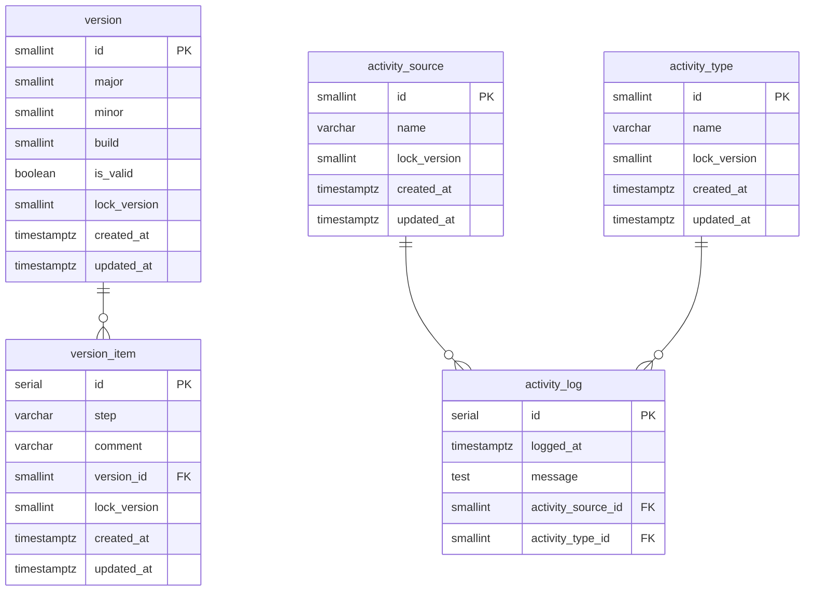
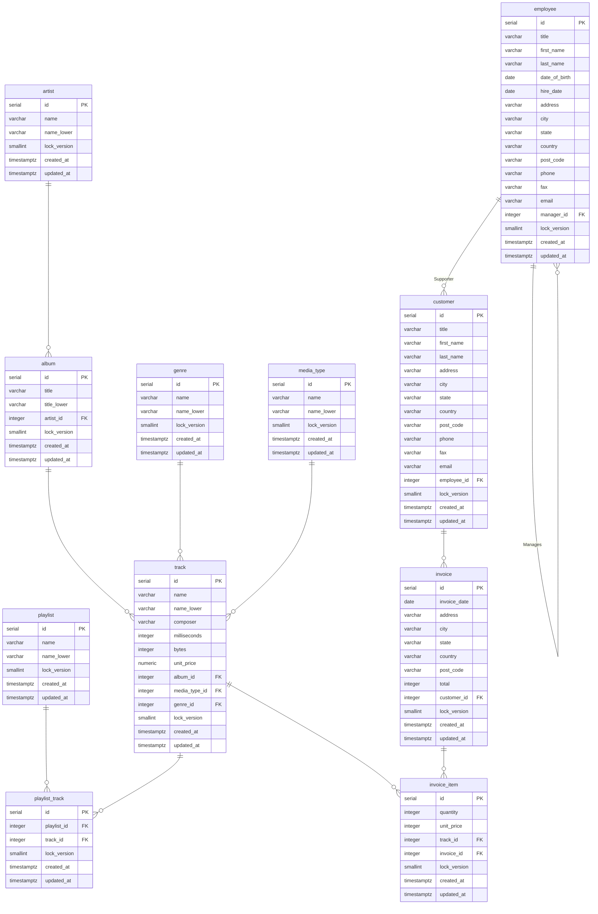
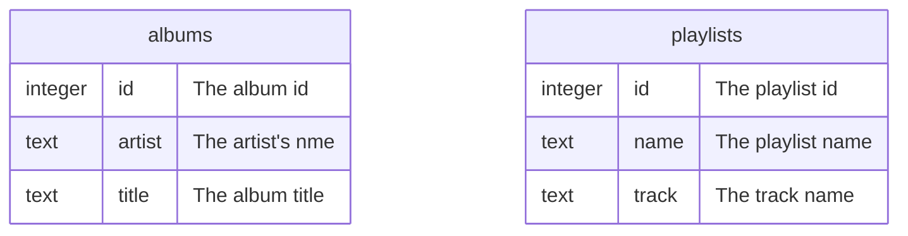

# PostgreSQL Design & Implementation

## System Tables

## Business Tables

## Views

The database contains two views, represented here as tables:

## Deployment

There are two options:

- Restore the database from the backup (backup.tar) stored in the postgresql folder.
- Create a new database using the install.sql script and the data scripts 01 thru 05 to populate the tables.
