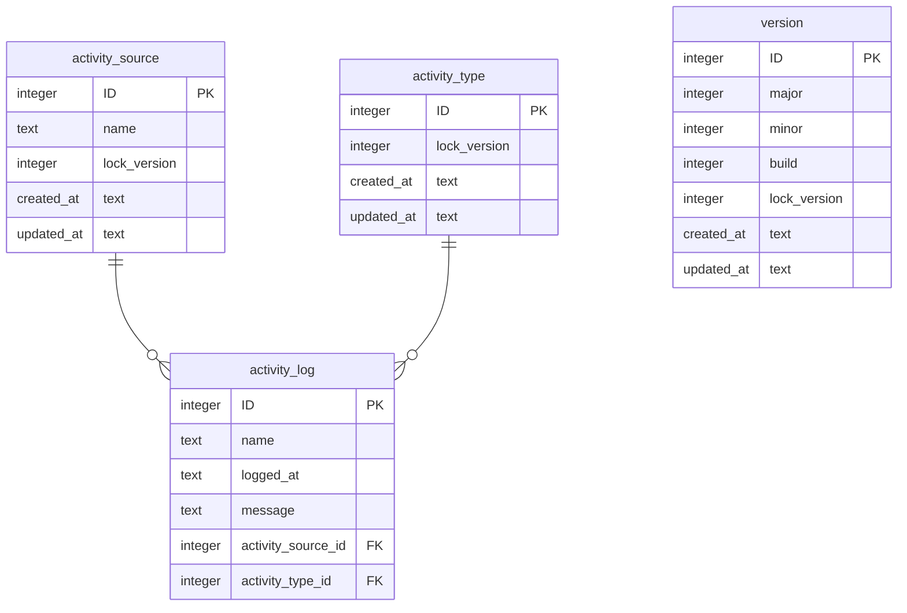
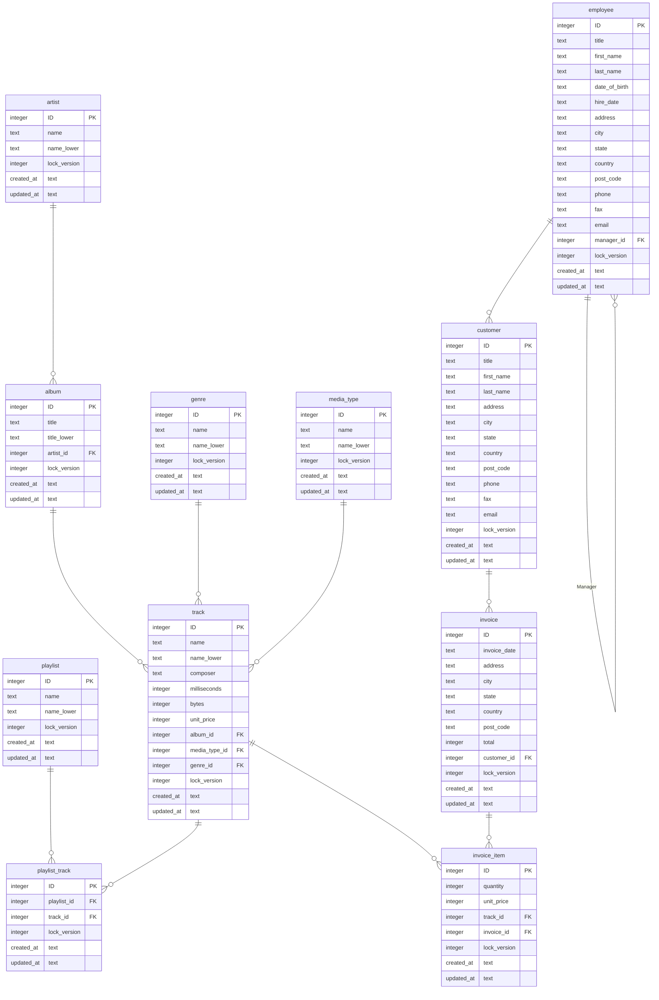

# SQLite Design & Implementation

The SQLite is not a full blown DBMS and so the implementation is limited to the capabilities of the DBMS.

## System Tables

## Business Tables

## Audit Tables

The audit tables are not modeled as they simply consist of the common fields described in the read me and the business 
attributes described above.

## Deployment

TODO
