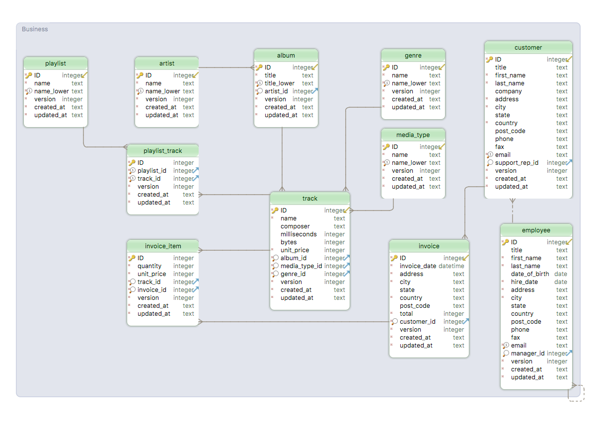
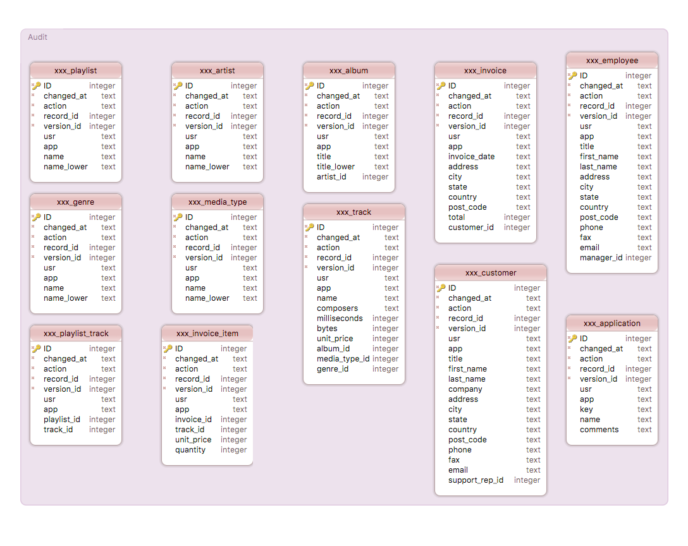
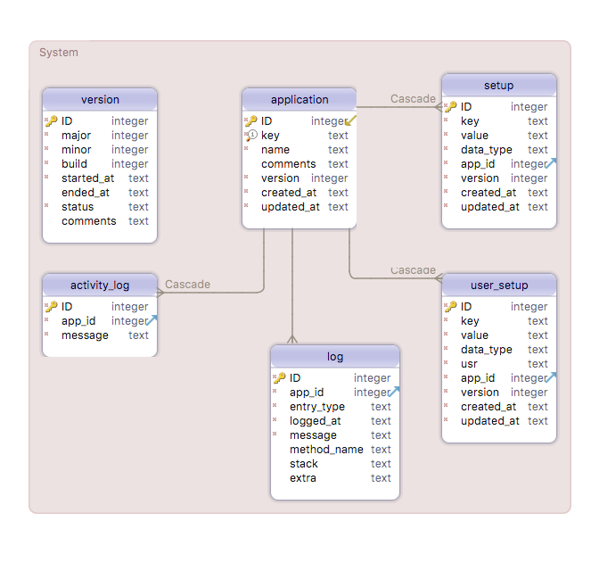
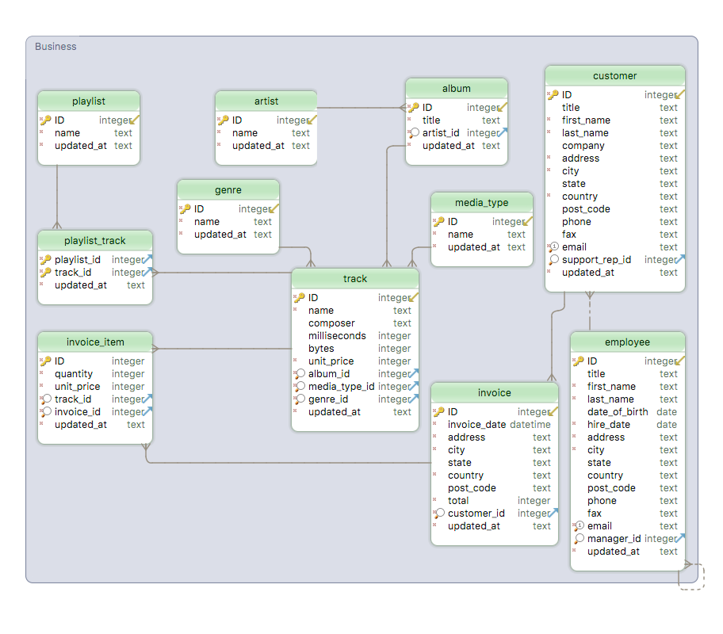

# SQLite Database

### Introduction

SQLite is a relational database management system (RDBMS) contained in a C library. In contrast to many other database management systems, SQLite is not a client–server database engine. Rather, it is embedded into the end program.

While SQLite is a popular choice as embedded database software for local/client storage in application software such as web browsers, etc., it is how ever ubiquitous and is the default DBMS offered by website development frameworks such as Ruby On Rails, Django, Wep2py and so on. Therefore, in working on the design of the idea SQLite database, we will assume it will be used in a multiuser environment.

### Preferred Design

The business entities of the database are set out below. Some of the key features included:

- The id field is in upper case to indicate that it is auto generated, otherwise it would appear in lower case.
- The tables playlist, artist, album, genre and media_type include a field titled name_lower which repeats the contents of the name field in lower case and is used to ensure that the name is unique.
- The album field contains a title_lower field, again to ensure that the titles remain unique.

There is an audit table for each of the business entities define in the database model.

The system tables includes a full complement of tables as described above. In particular an application table has been introduced to provide for the classification of setup, activity log, logging and user setup and configuration information.

Because each application has a requirement to know what it's id is, the application table includes a unique key that allows the application to retrieve it.

The user field is just a simple string field and is not associated in any way with the rest of the model. This is deliberate and ensures that the integrity of the business model is not in any way impacted by changes in the Human Resources domain. Although it assumes that the human resources environment ensures the the reference will be unique and not repeated over time by being assigned to new employees.

### Legacy Design

The legacy design is based on the preferred design, with the following changes:

- There are no audit tables
- The business tables do not have version or create fields, with the update_at field being used to handle optimistic concurrency.

As suggested else where in the documentation a simple version table has been added to the legacy design to aid in the application development phase.

### Data Type Stretcher

Each value stored in an SQLite database (or manipulated by the database engine) has one of the following storage classes:

| Name    | Comment                                                                                                     |
| ------- | ----------------------------------------------------------------------------------------------------------- |
| NULL    | Not really a data type, but indicates that the value stored was NULL                                        |
| INTEGER | The value is a signed integer, stored in 1, 2, 3, 4, 6, or 8 bytes depending on the magnitude of the value. |
| REAL    | The value is a floating point value, stored as an 8-byte IEEE floating point number.                        |
| TEXT    | he value is a text string, stored using the database encoding (UTF-8, UTF-16BE or UTF-16LE).                |
| BLOB    | The value is a blob of data, stored exactly as it was input.                                                |

A storage class is more general than a datatype. The INTEGER storage class, for example, includes 6 different integer datatypes of different lengths. This makes a difference on disk. But as soon as INTEGER values are read off of disk and into memory for processing, they are converted to the most general datatype (8-byte signed integer). And so for the most part, "storage class" is indistinguishable from "datatype" and the two terms can be used interchangeably. Any column in an SQLite version 3 database, except an INTEGER PRIMARY KEY column, may be used to store a value of any storage class.

As the legacy model already covers the three most common types, this model has just been extended by adding blob fields to the customer and employee tables. And a discount rate has been added to the Customer table.

### Files

The following files have been used to define, document and script the creating of these databases.

| File Name                                                                        | Description                                                                          |
| -------------------------------------------------------------------------------- | ------------------------------------------------------------------------------------ |
| [sqlite-preferred.sql](/src/sqlite/preferred/sqlite-preferred.sql)               | Creates the Preferred database                                                       |
| [sqlite-preferred-drop.sql](/src/sqlite/preferred/sqlite-preferred-drop.sql)     | Drops the Preferred database                                                         |
| [sqlite-preferred-data-1.sql](/src/sqlite/preferred/sqlite-preferred-data-1.sql) | Demo data: Genre, Media Type, Employee and Customer                                  |
| [sqlite-preferred-data-2.sql](/src/sqlite/preferred/sqlite-preferred-data-2.sql) | Demo data: Artist, Alubm and Tracks                                                  |
| [sqlite-preferred-data-3.sql](/src/sqlite/preferred/sqlite-preferred-data-3.sql) | Demo data: Invoice and Invoice Item                                                  |
| [sqlite-preferred-data-4.sql](/src/sqlite/preferred/sqlite-preferred-data-4.sql) | Demo data: Playlist and Playlist Track                                               |
| [sqlite-preferred-data-5.sql](/src/sqlite/preferred/sqlite-preferred-data-5.sql) | Demo data: Application, Activity Log, Log, Setup, User Setup, Version and Audit data |
| sqlite-legacy.dbs                                                                | Legacy database design for SQLite                                                    |
| sqlite-legacy.sql                                                                | Creates the Legacy database                                                          |
| sqlite-legacy-drop.sql                                                           | Drops the Legacy database                                                            |
| sqlite-stretch.dbs                                                               | Database types design for SQLite                                                     |
| sqlite-stretch.sql                                                               | Creates the stretch database                                                         |
| sqlite-stretch-drop.sql                                                          | Drops the stretch database                                                           |
